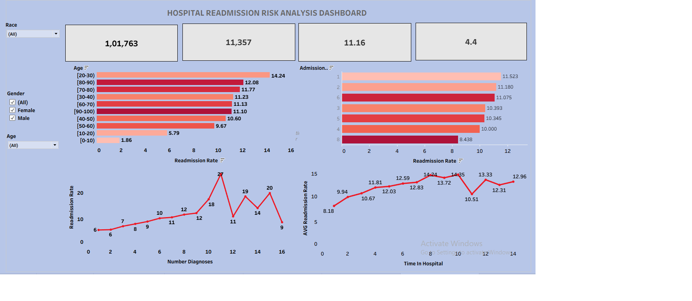

# Healthcare Readmission Analysis

## Overview
This project analyzes 30-day hospital readmission patterns among diabetic patients to identify key risk factors and support hospitals in improving discharge planning and reducing avoidable readmissions.

## Dataset
- 100,000+ diabetic patient encounters from multiple U.S. hospitals collected over a 10-year period
- Fields: patient demographics (race, gender, age), admission details, hospital stay metrics, prior utilization history, diagnoses, and readmission status
- Target variable: Readmission status (`<30 Days`, `>30 Days`, `No Readmission`)

## Tools
- **Python (Pandas, NumPy)** — data loading, EDA, cleaning, and feature engineering
- **SQL Server** — analytical querying
- **Tableau** — dashboard development
- **Gamma** — presentation deck creation

## Steps
1. Loaded the raw dataset in Python and explored its structure
2. Performed exploratory data analysis (EDA) on demographics, admissions, and utilization patterns
3. Cleaned the data:
   - Replaced missing value indicators (`?`) with nulls
   - Removed columns with excessive missing values
   - Removed unnecessary identifiers and medication-specific attributes
   - Handled invalid records and duplicates
   - Standardized column names and data types
4. Engineered new features: Readmission 30 Days Flag, Total Prior Visits, Long Stay Flag, Polypharmacy Flag, High Utilizer Flag
5. Loaded the cleaned data into SQL Server and ran queries to answer 8 business questions
6. Built an interactive Tableau dashboard to visualize readmission drivers
7. Compiled key findings into a written report
8. Created a summary presentation using Gamma

## Dashboard
A single-page interactive Tableau dashboard including:
- **KPIs:** Total Patients, 30-Day Readmissions, Readmission Rate, Average Length of Stay
- **Visuals:** Age Group vs Readmission Rate, Admission Type vs Readmission Rate, Length of Stay vs Readmission Rate, Number of Diagnoses vs Readmission Rate

-
*Figure 1: Executive overview — KPI and category analysis*

## Results
- Older patients showed higher 30-day readmission rates
- Longer hospital stays were associated with increased readmission likelihood
- Higher prior healthcare utilization correlated with greater readmission risk
- Readmission rates increased with the number of diagnosed conditions
- Certain admission and discharge categories showed significantly higher readmission rates

## How to Run
1. Load the raw dataset and run the Python cleaning/feature-engineering script
2. Import the cleaned dataset into SQL Server and execute the provided SQL scripts
3. Connect Tableau to the SQL Server output and open the dashboard workbook (`.twbx`)
4. Refer to the PDF report and Gamma slides for full findings and methodology

